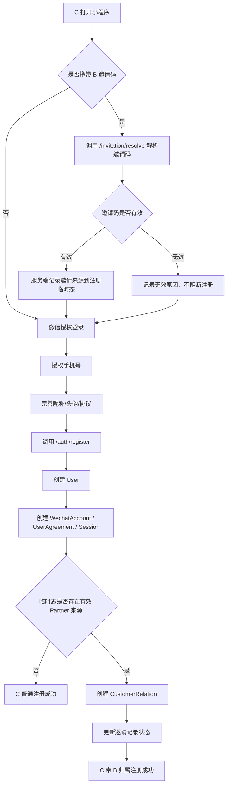
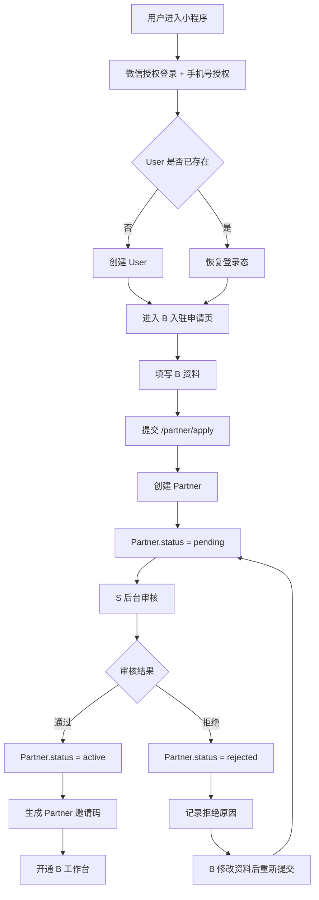
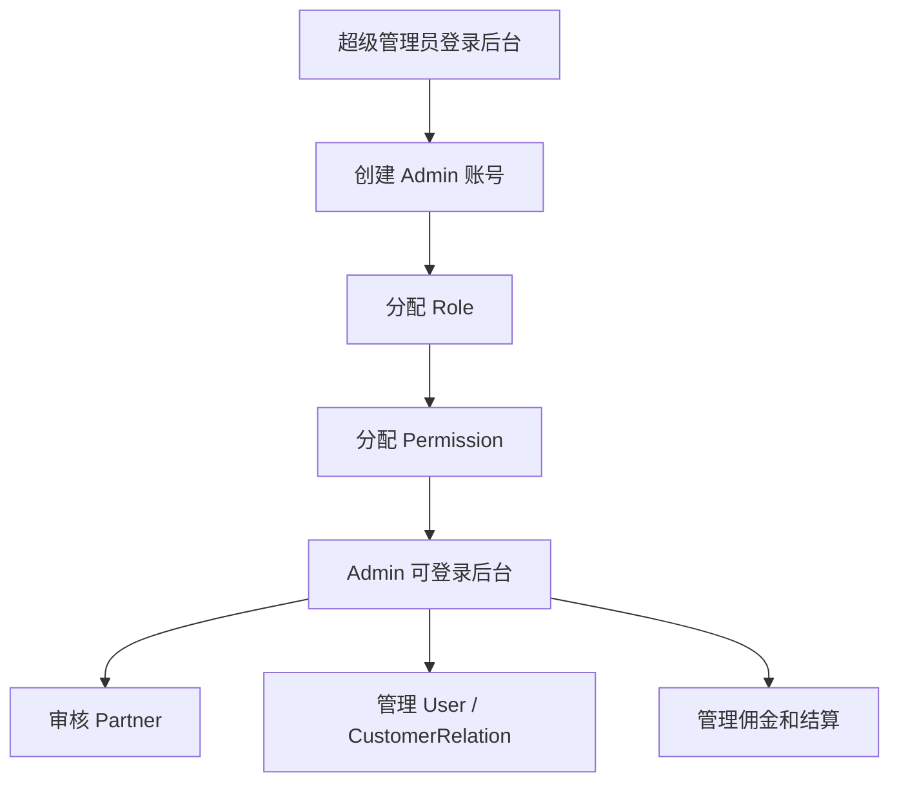
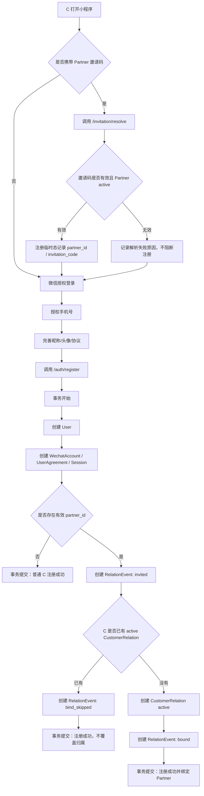
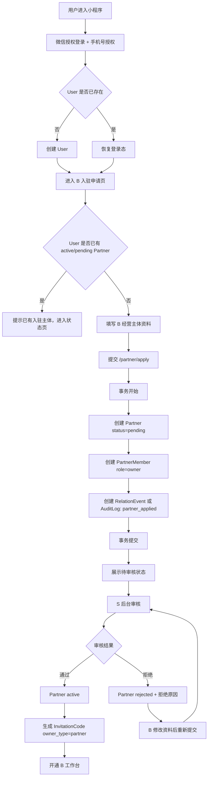
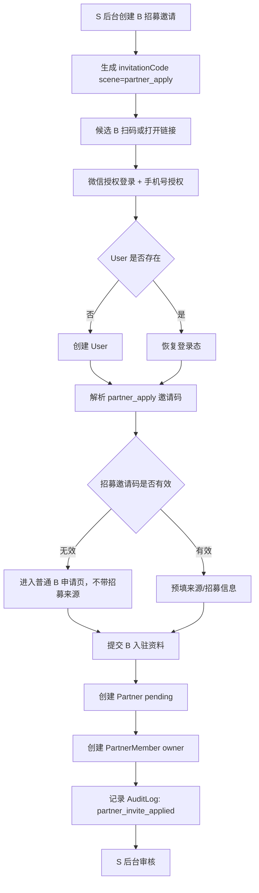
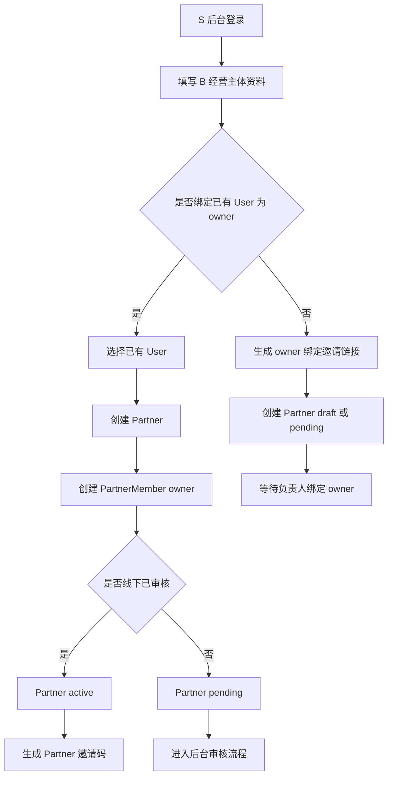
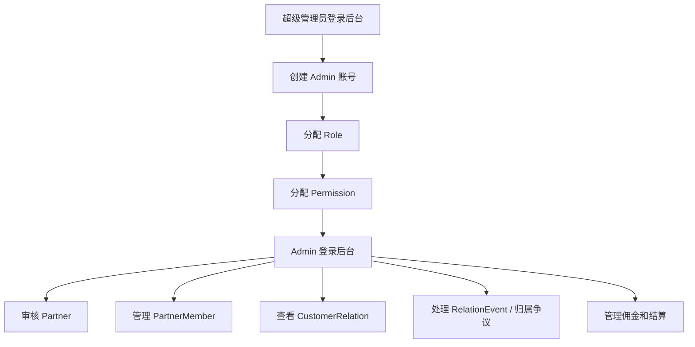

# S2B2C 两套方案注册流程图评审稿

## 1. 文档目的

本文档只聚焦“注册与入驻流程”，分别为当前评审中的两套方案输出流程图：

- 方案一：基础 S2B2C 方案，核心模型为 `User + Partner + CustomerRelation`。
- 方案二：升级平台化方案，核心模型为 `User + Partner + PartnerMember + CustomerRelation + RelationEvent`。

两套方案都遵循同一个底层原则：小程序端统一先注册 `User`，B 端能力通过入驻和审核获得，S 端账号通过后台管理体系创建。

## 2. 方案一：基础 S2B2C 注册流程

### 2.1 方案一模型边界

```text
User：登录账号和自然人资料
Partner：B 端经营主体，通常直接关联一个 user_id
CustomerRelation：B-C 当前归属关系
Admin：S 端后台管理员账号
```

方案一偏 MVP，表结构更少，适合快速上线验证 B 邀请 C、后台审核 B、后续佣金台账等核心闭环。

### 2.2 方案一 C 注册流程图



关键说明：

- C 不需要选择身份。
- B 邀请码只影响注册后的归属关系，不应阻断 C 基础注册。
- 邀请来源必须由服务端保存，不能只依赖前端缓存。
- `CustomerRelation` 在方案一只表达当前 B-C 归属，历史事件能力较弱。

### 2.3 方案一 B 注册/入驻流程图



关键说明：

- 方案一通常会在 `Partner` 上直接存 `user_id` 或 owner 信息。
- 一个 User 默认只能申请一个有效或待审核 Partner。
- 审核通过前，B 不应拥有正式 C 邀请码，也不应产生佣金。
- 方案一简单，但未来如果 B 变成门店或团队，会需要补成员表。

### 2.4 方案一 S 后台账号流程图



关键说明：

- S 不走小程序注册。
- S 使用后台 `Admin / Role / Permission`。
- B 审核、冻结、归属调整、佣金调账都应做权限控制。

### 2.5 方案一注册数据写入

| 流程 | 主要写入 |
|------|----------|
| C 普通注册 | `users`、`wechat_accounts`、`user_agreements`、`user_sessions` |
| C 通过 B 邀请注册 | 上述表 + `customer_relations` + 邀请记录状态 |
| B 主动入驻 | `users` + `partners` |
| B 审核通过 | `partners.status` + 邀请码 |
| S 后台创建 | `admins`、`roles`、`permissions` |

### 2.6 方案一适用判断

方案一适合以下情况：

- 第一版只需要个人 B 或轻量团长。
- B 不需要多人协作。
- 短期重点是验证邀请转化和 B-C 归属。
- 希望尽快上线，不希望第一版引入较多表。

主要风险：

- B 如果升级为门店、团队、机构，会需要补 `PartnerMember`。
- 归属变化历史不完整，后续处理佣金争议和客户转移会吃力。

## 3. 方案二：升级平台化注册流程

### 3.1 方案二模型边界

```text
User：登录账号和自然人资料
Partner：B 端经营主体，可以是个人、门店、服务商、机构
PartnerMember：User 在 Partner 下的成员身份，例如 owner、operator、finance
CustomerRelation：当前 B-C 有效归属
RelationEvent：邀请、绑定、转移、解绑、争议等关系事件
Admin：S 端后台管理员账号
```

方案二更适合长期平台化。MVP 仍可只开放一个 owner，但表结构先支持未来多人协作和完整关系审计。

### 3.2 方案二 C 注册流程图



关键说明：

- 邀请码归属 `Partner`，不是归属某个分享用户。
- 当前有效关系存 `CustomerRelation`。
- 注册、邀请、绑定、跳过绑定都写 `RelationEvent`，方便后续审计。
- MVP 不自动覆盖 C 已有归属，避免佣金和服务关系争议。

### 3.3 方案二 B 主动申请注册流程图



关键说明：

- `Partner` 是经营主体，`PartnerMember` 才表示谁能操作这个主体。
- MVP 只创建 owner，未来可以增加 operator、finance、customer_service。
- 审核通过后才生成正式 C 注册邀请码。
- B 状态页需要展示 pending、rejected、active、frozen 等状态。

### 3.4 方案二 B 受邀入驻流程图



关键说明：

- `scene=partner_apply` 与 C 注册的 `scene=register` 必须区分。
- B 受邀入驻创建的是 `Partner`，不是 `CustomerRelation`。
- 招募邀请可以统计渠道来源，但不自动让 B active。

### 3.5 方案二 后台代创建 B 流程图



关键说明：

- 后台直接创建 active Partner 必须有更高权限，例如 `partner:create-active`。
- 未绑定 owner 的 Partner 不能进入 B 工作台。
- 后台创建、owner 绑定、直接启用都必须写审计日志。

### 3.6 方案二 S 后台账号流程图



关键说明：

- S 仍然不走小程序注册。
- 方案二比方案一多了 B 成员管理和关系事件审计能力。
- `RelationEvent` 可以支撑客服、风控、佣金争议处理。

### 3.7 方案二注册数据写入

| 流程 | 主要写入 |
|------|----------|
| C 普通注册 | `users`、`wechat_accounts`、`user_agreements`、`user_sessions` |
| C 通过 B 邀请注册 | 上述表 + `customer_relations` + `relation_events` |
| B 主动入驻 | `users` + `partners` + `partner_members` + `audit_logs/relation_events` |
| B 受邀入驻 | 上述表 + 招募邀请来源 |
| 后台代创建 B | `partners` + 可选 `partner_members` + `audit_logs` |
| S 后台创建 | `admins`、`roles`、`permissions` |

### 3.8 方案二适用判断

方案二适合以下情况：

- B 未来可能是门店、团队、服务商或机构。
- 一个 B 主体未来可能由多人协作。
- 需要处理客户归属转移、解绑、争议。
- 后续要做佣金、结算、风控和审计。
- 希望 MVP 不复杂，但数据模型不想很快返工。

主要代价：

- 比方案一多 `PartnerMember` 和 `RelationEvent` 两个核心模型。
- 接口鉴权需要引入 Partner 上下文，例如当前用户是否是某个 Partner 的 owner。
- 注册和绑定流程中需要更多事务和事件记录。

## 4. 两套方案注册流程差异

| 对比项 | 方案一：基础模型 | 方案二：升级模型 |
|--------|------------------|------------------|
| B 与 User 关系 | Partner 通常直接关联 User | Partner 通过 PartnerMember 关联 User |
| B 多人协作 | 不支持或后续补 | 表结构天然支持 |
| C 归属历史 | 主要看当前 CustomerRelation | 当前关系 + RelationEvent 历史 |
| B 受邀入驻 | 可做，但来源表达较弱 | scene=partner_apply，来源更清晰 |
| 后台代创建 B | 可做，但 owner 绑定较弱 | Partner 与 owner 绑定分离 |
| 注册复杂度 | 低 | 中 |
| 长期扩展性 | 中 | 高 |

## 5. 推荐结论

如果目标只是尽快验证一级邀请和客户归属，方案一可以更快。

如果 BlissTribe 要做长期 S2B2C 平台，推荐采用方案二，但 MVP 只开放最小能力：

```text
User
Partner
PartnerMember(owner only)
CustomerRelation(active only)
RelationEvent(invited / bound / skipped / transferred)
```

暂缓能力：

- B 多成员管理。
- 多级分佣。
- 自动结算。
- 复杂归属争议流程。
- 完整组织/租户系统。

这样能兼顾 KISS 和长期扩展：第一版不把功能做复杂，但底层模型不会把 B 锁死成一个用户字段。

## 6. 评审问题

- 第一版 B 是否一定只有一个负责人？
- 未来是否会出现门店、机构、团队型 B？
- C 已有归属时，扫新 B 的码是否允许覆盖？
- 后台是否需要代 B 创建经营主体？
- B 受邀入驻是否需要单独邀请码场景 `partner_apply`？
- 关系事件第一版是否需要后台可视化，还是先只入库？
