# S2B2C B 端业务流程规划设计评审稿

## 1. 文档目的

本文档专门规划方案二下 B 端的业务流程、页面、接口、数据模型和实施阶段。

本文档基于以下模型：

```text
User + Partner + PartnerMember + CustomerRelation + RelationEvent
```

其中：

- `User`：登录账号和自然人资料。
- `Partner`：B 端经营主体，可以是个人、团长、达人、门店、服务商或机构。
- `PartnerMember`：User 在 Partner 下的成员身份。
- `CustomerRelation`：当前 B-C 归属关系。
- `RelationEvent`：B-C 关系事件账本。

## 2. B 的业务定位

B 不是简单推广员，而是平台授权的经营主体。B 的价值是帮助 S 触达、服务和转化 C。

B 的核心职责：

- 获客：通过邀请码、海报、社群、线下渠道拉新 C。
- 服务：维护自己的客户关系，推动转化和复购。
- 推广：推广 S 提供的产品、服务、活动或权益。
- 经营：查看数据、收益和结算状态。
- 合规：遵守平台规则，接受 S 的审核、风控和治理。

B 的业务边界：

| 能力 | MVP | P2/P3 |
|------|-----|-------|
| 入驻申请 | 支持 | 支持资质、合同、保证金 |
| 邀请 C | 支持 | 支持活动码、渠道码 |
| 客户管理 | 支持基础列表 | 支持跟进、标签、分组 |
| 产品推广 | P2 | 支持素材、活动、转化分析 |
| 订单转化 | P2/P3 | 支持支付、退款、售后 |
| 佣金收益 | P2/P3 | 支持自动结算、提现 |
| 成员管理 | 后置 | 支持多角色协作 |
| 风控处理 | 支持基础冻结 | 支持风险评分和申诉 |

## 3. B 生命周期总览

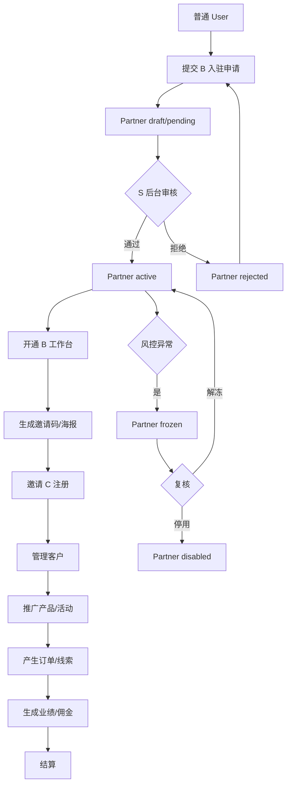

## 4. B 入驻与审核流程

### 4.1 主动申请

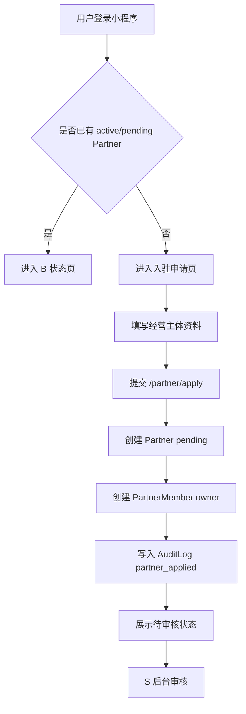

### 4.2 受邀入驻

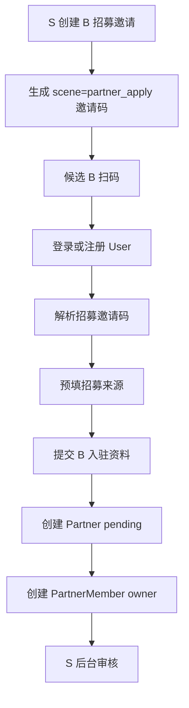

### 4.3 入驻资料

| 字段 | 必填 | 说明 |
|------|------|------|
| displayName | 是 | B 对外展示名称 |
| type | 是 | 个人、团长、达人、门店、服务商、机构 |
| contactName | 是 | 负责人姓名 |
| contactPhone | 是 | 联系手机号，密文存储 |
| regionCode | 否 | 地区 |
| profile | 否 | 经营简介、社群规模、渠道说明 |
| qualificationFiles | 否 | 资质文件，P2 |

### 4.4 审核状态

| 状态 | B 能力 | 说明 |
|------|-------|------|
| draft | 无 | 草稿，未提交 |
| pending | 查看状态 | 等待 S 审核 |
| active | 正常经营 | 可邀请、可查看客户、可推广 |
| rejected | 修改重提 | 审核拒绝 |
| frozen | 只读或受限 | 风控冻结 |
| disabled | 无 | 停用 |

## 5. B 邀请获客流程

### 5.1 标准流程

```mermaid
flowchart TD
  A[B 进入邀请页] --> B[获取 Partner 邀请码]
  B --> C[生成二维码/海报/分享链接]
  C --> D[B 分享给 C]
  D --> E[C 扫码进入小程序]
  E --> F[/invitation/resolve 解析 Partner]
  F --> G[C 完成注册]
  G --> H[创建 CustomerRelation active]
  H --> I[写入 RelationEvent invited/bound]
  I --> J[B 客户数增加]
```

### 5.2 邀请规则

- 邀请码归属 `Partner`，不是归属某个 `User`。
- 分享人可以记录为 `created_by_user_id`。
- `Partner.status != active` 时，邀请码不可绑定新 C。
- C 已有 active 归属时，MVP 不自动覆盖。
- 所有绑定、跳过绑定、失败原因写入 `RelationEvent`。

### 5.3 邀请数据

B 侧应看到：

- 邀请访问数。
- 授权数。
- 注册数。
- 绑定成功数。
- 无效/跳过绑定数。
- 今日新增客户。
- 累计客户。

## 6. B 客户管理流程

### 6.1 客户列表

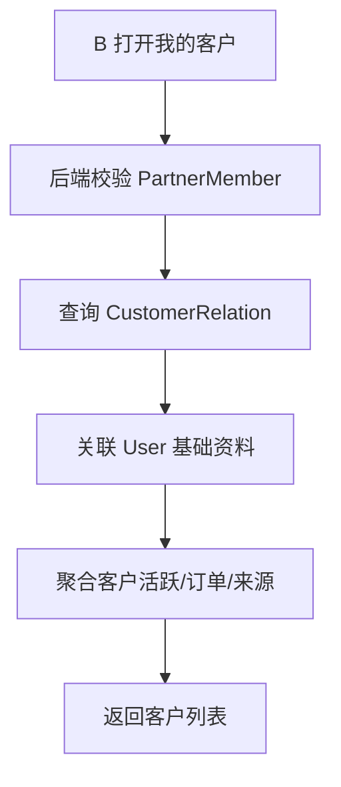

客户字段建议：

| 字段 | 说明 |
|------|------|
| customerUserId | C 用户 ID |
| nickname | 昵称 |
| avatar | 头像 |
| phoneMasked | 脱敏手机号，按权限控制 |
| boundAt | 绑定时间 |
| sourceInvitationCode | 来源邀请码 |
| lastActiveAt | 最近活跃 |
| orderCount | 订单数，P2 |
| totalAmountCent | 累计消费，P2 |
| relationStatus | 归属状态 |

### 6.2 客户详情

MVP 客户详情：

- 基础资料。
- 绑定来源。
- 绑定时间。
- 最近活跃。
- 注册来源事件。

P2 客户详情：

- 订单记录。
- 产品浏览记录。
- 跟进记录。
- 客户标签。
- 客户分组。

### 6.3 隐私规则

- B 不展示 C 明文手机号。
- 默认展示脱敏手机号。
- 客户联系方式、跟进记录、备注属于敏感业务数据。
- 后续若支持 B 联系 C，应通过平台授权、企微、IM 或工单系统，不建议直接暴露隐私信息。

## 7. B 产品推广流程

### 7.1 产品推广定位

B 不是产品创建方，MVP 中产品由 S 创建和上架，B 负责推广。

```text
S 上架产品/服务
  ↓
配置 B 可推广范围
  ↓
B 查看可推广产品
  ↓
B 获取推广素材
  ↓
B 分享给 C
  ↓
C 浏览、报名、下单或预约
```

### 7.2 流程图

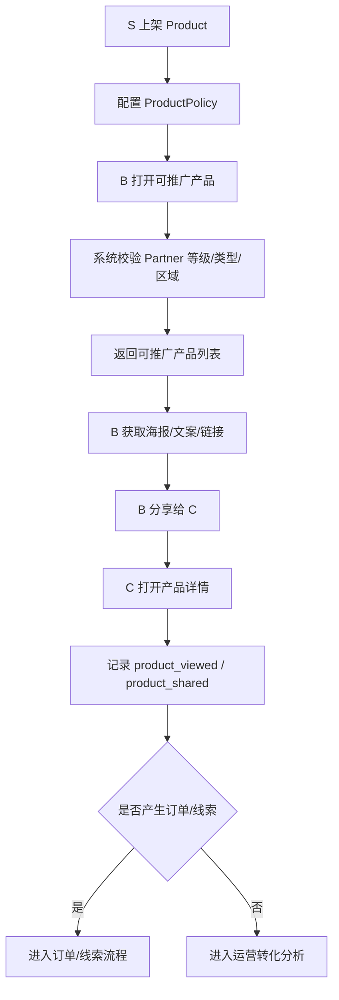

### 7.3 MVP 建议

第一版不必直接做完整商城。可以先支持：

- 产品/服务展示。
- B 可推广产品列表。
- 产品分享链接。
- 产品海报素材。
- C 报名/预约/留资。

支付、库存、物流、退款、售后放到 P2/P3。

## 8. B 订单/线索转化流程

### 8.1 线索模式

如果暂不接支付，推荐先做线索模式。

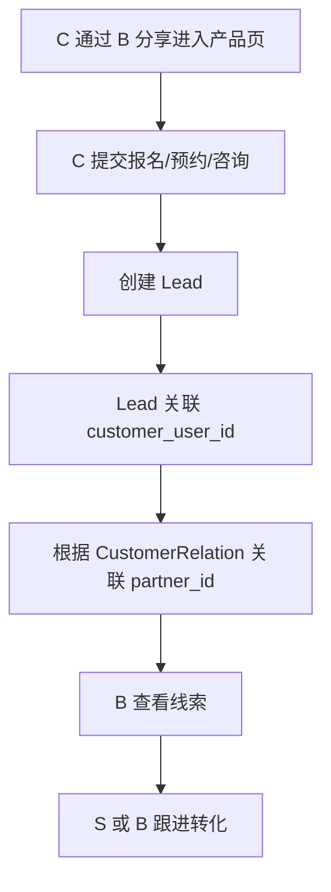

适用：

- 服务预约。
- 活动报名。
- 课程咨询。
- 本地服务。

### 8.2 订单模式

接入交易后使用订单模式。

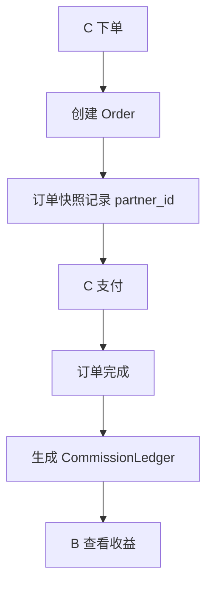

关键约束：

- 订单生成时必须快照 `partner_id`，不要结算时再查当前归属。
- 退款、取消、售后会影响佣金状态。
- 佣金生成必须幂等。

## 9. B 佣金收益流程

### 9.1 佣金状态

```text
pending     待确认
frozen      冻结中
settleable  可结算
settled     已结算
rejected    已驳回
```

### 9.2 流程图

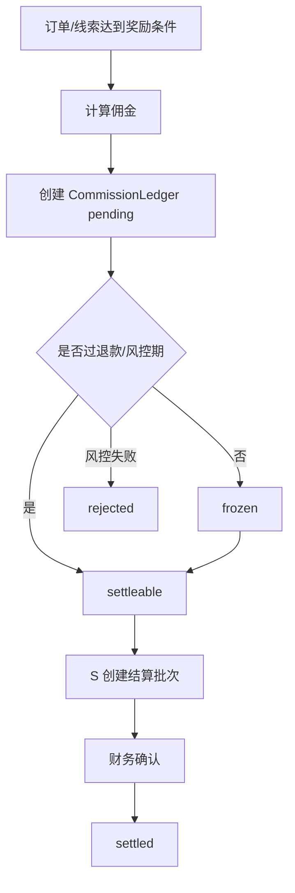

### 9.3 B 可见收益

B 工作台展示：

- 今日预估收益。
- 累计收益。
- 待确认。
- 冻结中。
- 可结算。
- 已结算。
- 驳回明细。

MVP 可以先展示统计占位，佣金台账后置。

## 10. B 结算流程

### 10.1 后台结算模式

MVP 推荐后台结算，不接自动打款。

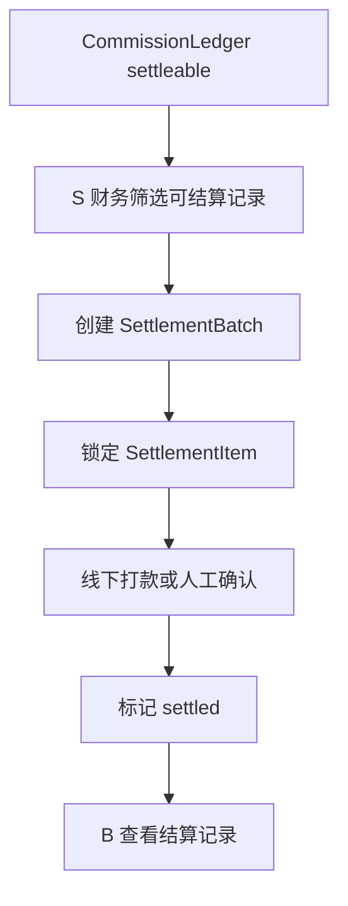

### 10.2 结算规则

- 最低结算金额。
- 结算周期。
- 冻结期。
- 风控拦截。
- 手工驳回原因。
- 财务备注。

## 11. B 成员管理流程

MVP 只做 owner。P2 开放成员协作。

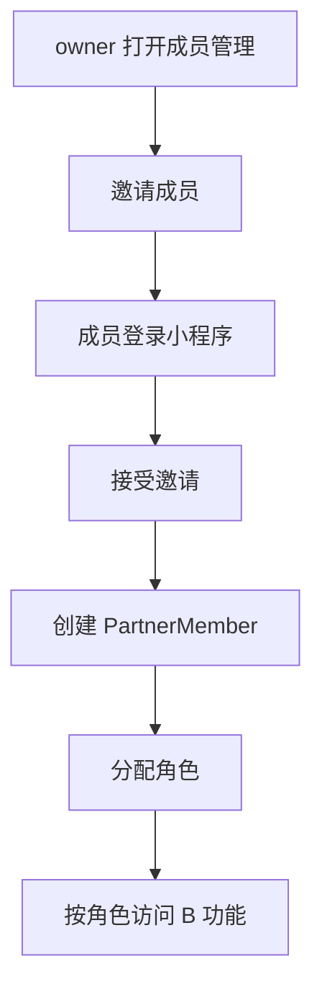

角色建议：

| 角色 | 权限 |
|------|------|
| owner | 全部权限 |
| operator | 邀请、客户、产品推广 |
| finance | 收益、结算 |
| customer_service | 客户查看、跟进 |

## 12. B 风控与违规流程

### 12.1 风控场景

| 场景 | 风险 |
|------|------|
| 短时间大量注册 | 刷邀请 |
| 同 IP/设备批量注册 | 虚假用户 |
| 异常高转化订单 | 刷单 |
| 高频客户归属争议 | 恶意抢客 |
| 佣金异常增长 | 财务风险 |

### 12.2 处理流程

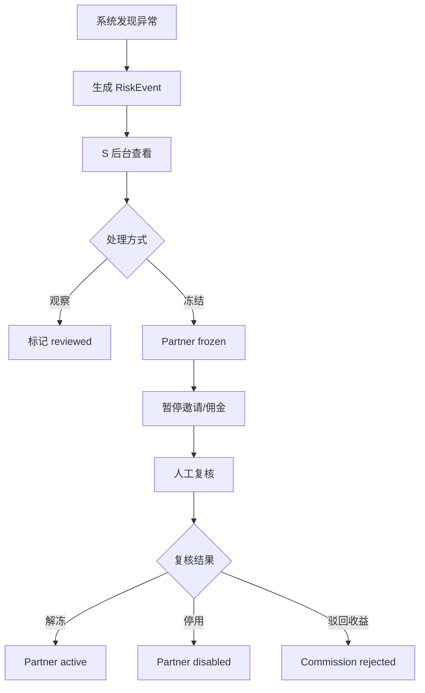

## 13. B 小程序页面规划

### 13.1 MVP 页面

| 页面 | 路径 | 说明 |
|------|------|------|
| 入驻申请 | `/pages/partner/apply` | 提交 B 资料 |
| 入驻状态 | `/pages/partner/status` | pending/rejected/frozen 展示 |
| B 工作台 | `/pages/partner/dashboard` | 核心指标 |
| 邀请客户 | `/pages/partner/invite` | 邀请码、海报 |
| 我的客户 | `/pages/partner/customers` | 客户列表 |

### 13.2 P2 页面

| 页面 | 路径 | 说明 |
|------|------|------|
| 可推广产品 | `/pages/partner/products` | 产品列表 |
| 产品素材 | `/pages/partner/product-materials` | 海报、文案 |
| 我的收益 | `/pages/partner/commissions` | 收益明细 |
| 结算记录 | `/pages/partner/settlements` | 结算批次 |
| 成员管理 | `/pages/partner/members` | 成员与角色 |

## 14. B 后端接口规划

### 14.1 入驻

| 接口 | 说明 |
|------|------|
| `POST /partner/apply` | 提交入驻 |
| `GET /partner/me` | 当前 Partner 状态 |
| `PUT /partner/me` | 修改资料 |
| `POST /partner/resubmit` | 被拒后重提 |

### 14.2 工作台

| 接口 | 说明 |
|------|------|
| `GET /partner/dashboard` | 工作台指标 |
| `GET /partner/invitation-code` | 获取邀请码 |
| `POST /partner/invitation-code` | 生成/刷新邀请码 |

### 14.3 客户

| 接口 | 说明 |
|------|------|
| `GET /partner/customers` | 客户列表 |
| `GET /partner/customers/:id` | 客户详情 |
| `GET /partner/customer-relations` | 归属关系 |

### 14.4 产品与收益

| 接口 | 说明 |
|------|------|
| `GET /partner/products` | 可推广产品 |
| `GET /partner/products/:id/materials` | 产品素材 |
| `GET /partner/commissions` | 收益明细 |
| `GET /partner/settlements` | 结算记录 |

### 14.5 成员，P2

| 接口 | 说明 |
|------|------|
| `GET /partner/members` | 成员列表 |
| `POST /partner/members/invite` | 邀请成员 |
| `PUT /partner/members/:id/role` | 修改角色 |
| `DELETE /partner/members/:id` | 移除成员 |

## 15. B 数据模型规划

MVP 必须：

- `partners`
- `partner_members`
- `invitation_codes`
- `invitation_records`
- `customer_relations`
- `relation_events`
- `audit_logs`

P2/P3：

- `products`
- `product_policies`
- `materials`
- `leads`
- `orders`
- `commission_ledgers`
- `settlement_batches`
- `risk_events`

关键索引：

- `partner_members(user_id, status)`
- `customer_relations(partner_id, status)`
- `customer_relations(customer_user_id) WHERE status = 1`
- `relation_events(partner_id, created_at)`
- `invitation_codes(code)`
- `commission_ledgers(partner_id, status, occurred_at)`

## 16. MVP 实施范围

第一版建议只做：

```text
B 入驻
S 审核 B
B 获取邀请码
B 邀请 C
B 查看客户
B 查看基础数据
```

暂缓：

- 产品推广。
- 订单支付。
- 自动佣金。
- 自动结算。
- 多成员协作。
- 客户跟进 CRM。

这样能先验证两个关键假设：

- B 是否愿意入驻。
- B 是否能带来有效 C。

## 17. 实施阶段

### 阶段 1：B 生命周期

- Partner。
- PartnerMember owner。
- B 入驻页。
- 后台审核。
- B 状态页。

### 阶段 2：邀请与客户

- Partner 邀请码。
- C 注册绑定。
- CustomerRelation。
- RelationEvent。
- B 客户列表。

### 阶段 3：B 工作台

- 邀请数据。
- 客户数据。
- 基础转化数据。
- 后台经营看板。

### 阶段 4：产品推广

- Product。
- ProductPolicy。
- Materials。
- B 可推广产品。

### 阶段 5：交易收益

- Lead 或 Order。
- CommissionLedger。
- SettlementBatch。
- 风控事件。

## 18. 待评审问题

- B 第一版是否只允许一个 owner？
- B 类型第一版需要哪些：个人、团长、达人、门店、服务商？
- B 是否必须审核通过才能生成邀请码？
- C 已有归属时，B 是否能申请转移？
- B 客户列表是否展示脱敏手机号？
- 第一版是否需要 B 查看收益，还是只看邀请和客户？
- 产品推广是否作为 P2，而不是 MVP？
- 第一版是否需要客户跟进记录？
- 风控冻结后，B 是否还能查看历史客户和收益？
